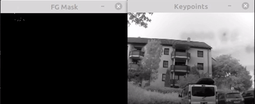

[](https://github.com/xeonqq/co-pilot/actions/workflows/main.yml)

Traffic light alert and Dashcam all in one.

`Co-Pilot` = Raspberrypi 3/4 + rpi camera + Google Coral TPU. Language support English/中文.

 
## Features
  * Real time traffic light voice alert based on situation.
  * HD dashcam recording.
  * Surveillance mode, records only when motion is detected.
  * Auto deletion of old files when disk full.
  * One button for mode selection.
  
 <a class="bmc-button" target="_blank" href="https://www.buymeacoffee.com/xeonqq"><span style="margin-left:5px;font-size:19px !important;">Buy me a coffee 😇</span></a>
   
## Watch the demo in car
[](https://youtu.be/tCmUoWLdjoo)

  What Co-Pilot sees | Voice alerts based on situation
 -------- | -------- 
   | *Ready-go / Green-go-go-go / Attention-red / Yellow-no-rush*

## Hardware Setup


 Version | Front | Back
 -------- | -------- | --------
 v0.1 |   |
 v0.2: using [min speaker](https://de.aliexpress.com/item/1005003107656299.html?spm=a2g0o.productlist.0.0.19bff4543zIpil&algo_pvid=84ba9ca6-b578-4f5f-bc2f-84c493d38095&algo_exp_id=84ba9ca6-b578-4f5f-bc2f-84c493d38095-31&pdp_ext_f=%7B%22sku_id%22%3A%2212000024125609922%22%7D&pdp_pi=-1%3B3.5%3B-1%3B-1%40salePrice%3BEUR%3Bsearch-mainSearch) | | 
 v0.3: [custom designed housing](https://www.thingiverse.com/thing:5187983) |  | 
 
optional: [RTC DS3231](https://www.ebay.de/itm/223727782675?ssPageName=STRK%3AMEBIDX%3AIT&_trksid=p2060353.m2749.l2649), to have correct date on the dashcam video and log.

## Limitations
* Currently works only with vertically placed traffic lights, optimized for Germany.
* Delay of ~0.3 sec for each detection (Rpi 4 might have better performance, didn't have one to test)
* Performance drops during night

## Dependencies
```bash on rpi
echo "deb https://packages.cloud.google.com/apt coral-edgetpu-stable main" | tee /etc/apt/sources.list.d/coral-edgetpu.list
curl https://packages.cloud.google.com/apt/doc/apt-key.gpg | apt-key add -
apt-get update
udo apt install -y python3-opencv
apt-get install -y libedgetpu1-std
apt-get install -y python3-pycoral
apt-get install -y python3-tflite-runtime
python3 -m pip install -r requirements_pi.txt
sudo apt-get install libsdl2-mixer-2.0-0  libsdl2-2.0-0

# instal ffmpeg
cd ~ && git clone --depth 1 https://code.videolan.org/videolan/x264
cd x264
./configure --host=arm-unknown-linux-gnueabi --enable-static --disable-opencl
make -j4 && sudo make install
cd ~ && git clone git://source.ffmpeg.org/ffmpeg --depth=1
./configure --extra-ldflags="-latomic" --arch=armel --target-os=linux --enable-gpl --enable-omx --enable-omx-rpi --enable-nonfree
make -j4 && sudo make install
```
## Run Co-Pilot
```bash
python3 -m src.main  --ssd_model models/ssd_mobilenet_v2_coco_quant_no_nms_edgetpu.tflite  --label models/coco_labels.txt --score_threshold 0.3 --traffic_light_classification_model models/traffic_light_edgetpu.tflite  --traffic_light_label models/traffic_light_labels.txt --blackbox_path=./
```
I use [superviser](http://supervisord.org/) to start co-pilot at RPI boot up.
## Run Dashcam only mode
```bash
python3 -m src.dashcam
```
## Run Surveillance mode
like dashcam mode, but record only if motion is detection
```bash
python3 -m src.dashcam --record_on_motion
```
Watch how the motion is detected under the hood: 



## Run task manager to be able to select any mode
```bash
python3 -m src.task_manager --blackbox_path=/mnt/hdd
```
A detailed description of the mode selection can be found in [user manual](https://github.com/xeonqq/copilot-manual/blob/master/manual.pdf).

## Adjust volume
Once you've SSH'd into your Pi, type "alsamixer". This will bring up an interface within the terminal which will allow you to set the volume of the Raspberry Pi. Simply press the up and down arrow keys to either increase or decrease the volume. When you are done, press ESC.

## Test
```bash
# under repo root folder
python3 -m pytest
# or
python3 -m tests.test_detection
python3 -m tests.test_classification
```

## Reprocess with recorded video (On Host PC)

Build and run docker container
```bash
./build.sh
./linux_run.sh
```

In docker container
```bash
cd workspace
python3 -m src.reprocess  --ssd_model models/ssd_mobilenet_v2_coco_quant_no_nms_edgetpu.tflite  --label models/coco_labels.txt --score_threshold 0.3 --traffic_light_classification_model models/traffic_light_edgetpu.tflite  --traffic_light_label models/traffic_light_labels.txt --blackbox_path=./ --video recording_20210417-090028.h264.mp4 --fps 5
```

Both main and reprocess can be run without Coral TPU by specifying --cpu option.

## References
* SSD model is downloaded from https://github.com/google-coral/test_data/blob/master/ssd_mobilenet_v2_coco_quant_postprocess_edgetpu.tflite


